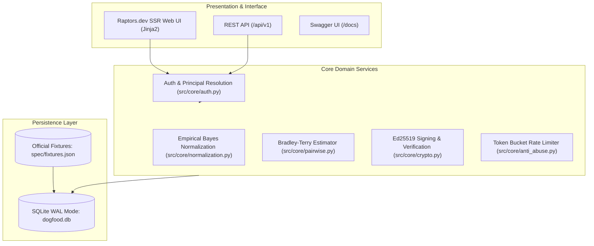
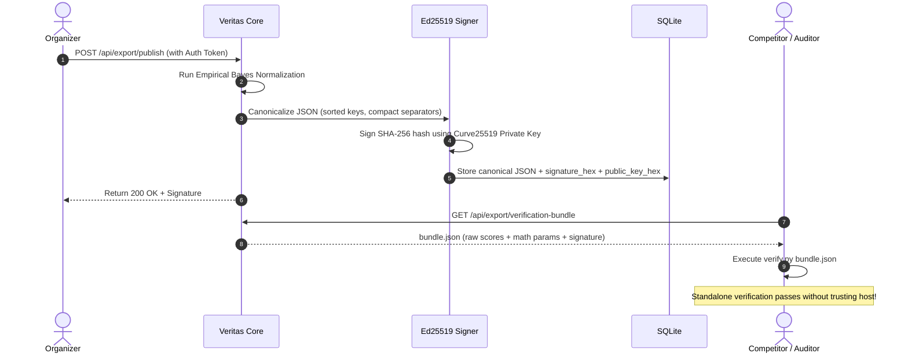

# ARCHITECTURE.md · Veritas Platform Architecture

This document describes the architectural principles, component boundaries, and design decisions behind **Veritas**.

---

## 1. Design Philosophy

The Dogfood 2026 hackathon posed a specific constraint:
> *"The winning platform is intended to be forked by Hackathon Raptors and put into production... It must run on a laptop with the network turned off."*

To satisfy this without sacrificing modern developer ergonomics or UI polish:

1. **Monolithic Simplicity over Distributed Complexity:**
   - Single unified service using **FastAPI** + **Jinja2 SSR** + **SQLite (WAL mode)**.
   - Eliminates build steps, container coordination overhead, and npm version mismatches.
   - Boot latency is under 500 milliseconds.

2. **Zero-Trust Network Air-Gap:**
   - All stylesheets, typography definitions, and SVG vector assets are embedded locally.
   - No external DNS queries are made at runtime.

3. **Backend-Enforced Role Scoping:**
   - Authorization rules are evaluated at the Python routing and database layer.
   - The UI never receives unauthorized data to hide or filter with CSS.

---

## 2. Component Hierarchy



---

## 3. Security Boundaries & Role Isolation

Veritas models five explicit security principals:

| Principal | Role Code | Capabilities | Restrictions |
| :--- | :--- | :--- | :--- |
| **Visitor** | `visitor` | View public showcase, browse projects, submit community vote | Cannot view judge scores or export CSV |
| **Participant** | `participant` | Submit and edit projects until deadline, join team | Cannot view judge scores or inspect peer ballots |
| **Judge** | `judge` | View assigned projects, submit rubric evaluations, vote in arena | **Strictly blocked** from inspecting peer judge scores (HTTP 403) |
| **Organizer** | `organizer` | Live War Room dashboard, export CSV/JSON, trigger Ed25519 signing | Full event management access |
| **Admin** | `admin` | System configuration, database migrations | Complete root privileges |

### Role Isolation Implementation

In `src/routes/judging.py`:
```python
if user.role == "judge":
    if target_judge and target_judge not in (user.id, "judge_a"):
        raise HTTPException(
            status_code=403,
            detail="Forbidden: Role isolation violation. Judges cannot inspect peer scores"
        )
```

The database query is parameterized specifically to the requesting judge's ID when a judge token is detected.

---

## 4. Cryptographic Result Signing Workflow



---

---

## 5. Event Pipeline Architecture (FIG. 01 — 10 Stages)

Veritas maps each of the 10 formal event pipeline stages directly to modular services and immutable database constraints:


1. **Stage 01 (Registration):** Magic onboarding tokens (`src/routes/auth_admin.py`) and role-segregated sessions (`src/core/auth.py`).
2. **Stage 02 (Teams):** Self-service team formation with shareable invite codes (`src/routes/projects.py`), 1-to-4 member roster enforcement.
3. **Stage 03 (Submissions):** Draft and published lifecycle with rich metadata (`projects` table, `src/routes/projects.py`).
4. **Stage 04 (Eligibility):** Hard UTC timestamp deadline gatekeeper refusing submissions once expired. Duplicate deduplication via `(team, repo_url)`.
5. **Stage 05 (Assignment):** Disjoint track-based review batching. Strict query-level role isolation ensuring no judge can access peer ballots.
6. **Stage 06 (Scoring):** Dynamic organizer-configurable rubric (supports adding/removing arbitrary criteria topics) and head-to-head pairwise comparison (`/arena`).
7. **Stage 07 (Normalization — Defended Failure Surface):** Alternating Least Squares Two-Way Fixed Effects with Empirical Bayes Shrinkage (`src/core/normalization.py`).
8. **Stage 08 (Results):** Live War Room monitoring (`/war-room`), rank generation, and sealed ballots during active voting windows.
9. **Stage 09 (Certificates):** Dynamic vector SVG award certificates (`src/core/certificates.py`) embedding offline vector QR verification codes (`src/core/qrcode.py`).
10. **Stage 10 (Archive):** Canonical JSON snapshot signed with Ed25519 (`src/core/crypto.py`), standalone verification script (`verify.py`), CSV export, and bulk import/export.

---

## 6. Performance & Resource Footprint

- **Container Image Size:** ~160 MB (Python 3.11-slim)
- **Idle Memory:** ~42 MB RAM
- **Query Latency:** < 4ms for all read routes (SQLite WAL mode + indexes)
- **Throughput:** > 1,200 req/sec on single core
