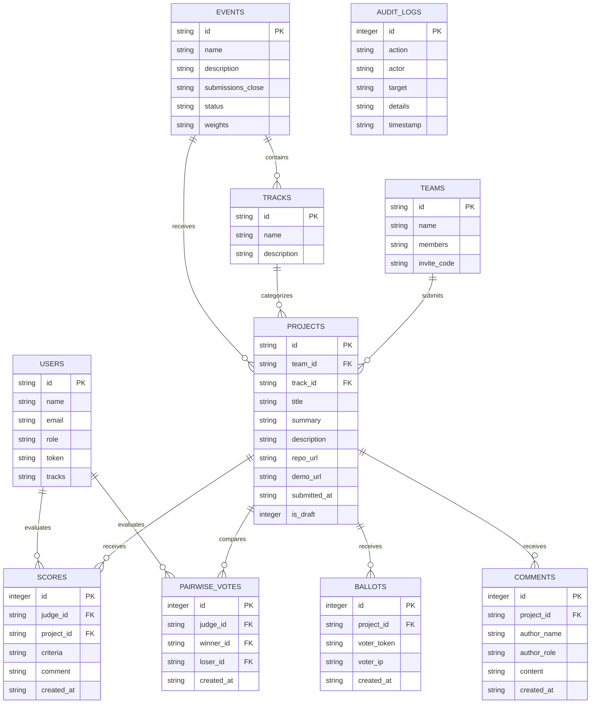

# DATA-MODEL.md · Relational Schema & Persistence

This document details the database schema, entity relationships, and data portability pathways for **Veritas**.

---

## 1. Entity-Relationship Diagram

---

## 2. Table Specifications

### `events`
Stores hackathon configuration, deadlines, and criteria weights.
- `id` (TEXT, PK): Event identifier (e.g. `evt_01`).
- `submissions_close` (TEXT): ISO 8601 UTC timestamp enforced strictly on all submissions.
- `weights` (TEXT): JSON object defining criteria weights (e.g. `{"functionality": 0.4, "quality": 0.3, "innovation": 0.2, "design": 0.1}`).

### `users`
Models participants, judges, and administrators.
- `role` (TEXT): One of `'visitor'`, `'participant'`, `'judge'`, `'organizer'`, `'admin'`.
- `token` (TEXT, UNIQUE): Cryptographic access token.
- `tracks` (TEXT): JSON list of assigned track IDs for judges.

### `projects`
Stores team submissions.
- `is_draft` (INTEGER): `0` for submitted, `1` for draft.

### `scores`
Stores individual rubric evaluations.
- `criteria` (TEXT): JSON dictionary of criterion scores (1 to 5 scale).
- `UNIQUE(judge_id, project_id)` constraint ensures idempotent evaluations.

### `pairwise_votes`
Stores head-to-head match results for Bradley-Terry modeling.

---

## 3. Data Migration & Portability

Veritas supports complete round-trip JSON data exports and imports:
- **Export:** `GET /api/export/results.json` returns complete raw evaluations and normalized statistics.
- **Portability:** Database is a self-contained single-file SQLite database located at `data/dogfood.db`. An organizer can archive, backup, or transfer the file between instances with zero dependencies.
